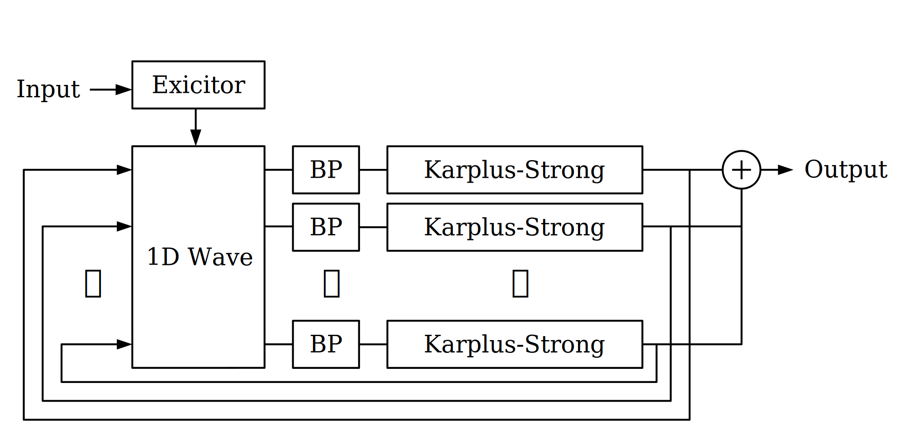

# WaveCymbal2
A banded waveguide synthesizer. Most of times, it sounds like dragging a bunch of empty can or knocking a glass bin. Perhaps there exists a cymbal-ish sound somewhere in the parameter space.

- [Demo (github.io)](https://ryukau.github.io/WaveCymbal2/)

# Signal Flow


- Input is an impulse.
- Exicitor is comb filters that transforms an impulse to more plausible contact sound.
- 1D Wave is 1 dimentional wave equation with spring and damper terms.
- BP is bandpass filter.
- Karplus-Strong is plucked string sound generator.

Equation used in 1D Wave.

```
m * u_tt + a * u_t + k * u = c^2 ∇^2 u
```

# Libraries
- [mersenne-twister](https://github.com/boo1ean/mersenne-twister)

# License
MIT
